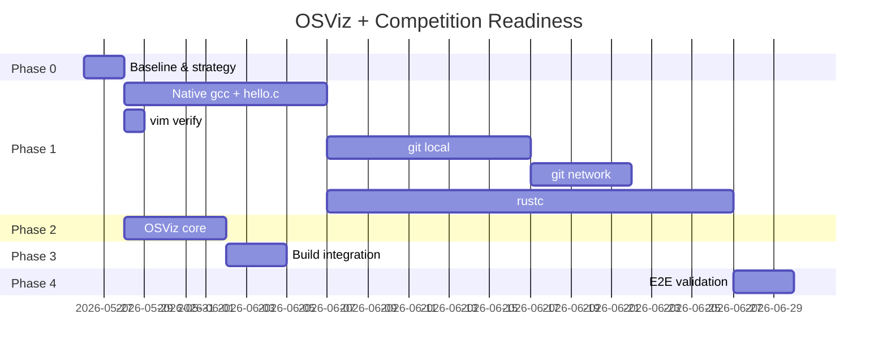

## Current Status vs. Design (`123.md`)

### What already exists (Step 6 build)

| Area | Current state | Design target |
|------|---------------|---------------|
| **Base system** | RISC-V64 Linux, glibc, ext4, virtio-blk/net | Same |
| **Shell / utils** | busybox, bash, coreutils | Required for observation commands |
| **vim** | ✅ `/usr/bin/vim` (9.1.1684) | ✅ vim 9.1 |
| **python3 + snake** | ✅ present | Not in competition scope |
| **gcc** | ❌ cross-only on host (`riscv64-linux-gcc`); no native `/usr/bin/gcc` | Native `gcc` 14.2.0 on target |
| **git** | ❌ missing | git 2.47.3 + network/SSH deps |
| **rustc** | ❌ missing | rustc 1.83.0 |
| **Network** | ✅ virtio-net, DHCP via `S40network`, QEMU user netdev | Required for git clone/push/pull |
| **Observation cmds** | ✅ `ps`, `free`, `mount`, `df` via busybox/coreutils | Used by `osviz-snapshot` |
| **OSViz infra** | ✅ `package/osviz/`（log 库、`osviz-record`、`osviz-snapshot`、`osviz-help`、`S98osviz`）；`make osviz` + `build.sh` 已接入 | 与 `123.md` 一致 |
| **Test sources** | ❌ no `hello.c` / `helloworld.rs` | `package/osviz-tests/` |
| **Build integration** | ✅ `Makefile` 目标 `osviz`；`build.sh` 在 `rebuild-target-image` 前执行 `make osviz` | 另见 `osviz-tests` / `user-tests`（未实现） |

Incremental workflow
If you only change OSViz sources:


make osviz
make rebuild-target-image

### Critical blocker

The competition reference image is **Alpine + musl** (`soft-info.txt`), but this project builds a **glibc** rootfs. Alpine binaries **cannot be copied directly** — they need to be built for glibc or the rootfs base must change.

---

## Project Plan

### Phase 0 — Baseline & decision (1–2 days)

**Goal:** Confirm what works today and lock the integration strategy.

| Task | Action | Done when |
|------|--------|-----------|
| 0.1 | Boot QEMU, verify vim/bash/network | `vim -h`, `ping` (if available), DHCP on eth0 |
| 0.2 | Version audit vs `soft-info.txt` | Gap report: vim OK; gcc/git/rustc missing |
| 0.3 | **Strategy decision** | Choose one path (see below) |

**Strategy options:**

| Option | Pros | Cons |
|--------|------|------|
| **A. Build from source (glibc)** | Fits current repo; no ABI mismatch | git/rustc are large; weeks of work |
| **B. Switch to Alpine/musl rootfs** | Matches competition binaries exactly | Major pivot away from course build |
| **C. Hybrid** | Build gcc natively; import only smaller tools | Still complex; version alignment hard |

**Recommendation:** **Option A** for gcc (native bootstrap), defer git network tasks until deps are ready. For git/rustc, evaluate whether full source build is feasible or if a musl-compat layer is needed.

---

### Phase 1 — Competition software (critical path) — M3

**Goal:** Pass on-site test tasks locally (no network first, then network).

#### 1a. Native gcc + hello.c (Task 3.1–3.2) — ~1–2 weeks

```
package/gcc-native/     # build gcc as target binary → /usr/bin/gcc
package/osviz-tests/
  hello.c
  make.sh               # install to /root/hello.c
```

| Milestone | Acceptance |
|-----------|------------|
| M3a | `gcc --help` runs in guest |
| M3b | `gcc hello.c && ./a.out` prints `Hello, World!` |

#### 1b. vim verification (Task 2.1–2.2) — ~1 day

Already mostly done. Verify:

```bash
vim -h
vim hello.c   # edit, save, reopen
```

#### 1c. git local tasks (Task 1.1–1.2) — ~1–2 weeks

Add `package/git/` with dependencies:

```
curl, openssl, zlib, expat, libssh2 (or openssh), git
```

| Milestone | Acceptance |
|-----------|------------|
| M3c | `git help` |
| M3d | `git init && git add . && git commit && git log` in `/root/proj` |

#### 1d. git network tasks (Task 1.3) — ~3–5 days

Requires: working SSH client, DNS, outbound network in QEMU.

| Milestone | Acceptance |
|-----------|------------|
| M3e | `git clone`, `git push`, `git pull` against test repo |

#### 1e. rustc + helloworld.rs (Task 4.1–4.2) — ~2–4 weeks

Largest dependency chain (llvm, etc.). Consider doing this **last**.

| Milestone | Acceptance |
|-----------|------------|
| M3f | `rustc -h` |
| M3g | `rustc helloworld.rs && ./helloworld` |

---

### Phase 2 — OSViz core — M1 + M2 ✅（已实现）

**Goal:** Observability layer (can start in parallel with Phase 1a).

已实现内容见 `package/osviz/` 与 `README.md` §5.3 OSViz 小节。

| Milestone | 验收 |
|-----------|------|
| M1 | `osviz-record` / `osviz_log_event` 写入 `/var/log/osviz/events.jsonl` |
| M2 | `osviz-snapshot` 生成含 boot/irq/mem/proc/fs/user/pagetable 的 JSON |
| M2b | `osviz-help` 打印现场赛命令速查 |

---

### Phase 3 — Build integration — M4 + M5（部分完成）

**Goal:** Wire everything into the existing build flow.

**Done:** `Makefile` 目标 `osviz`；`build.sh` 在 `rebuild-target-image` 前执行 `make osviz`（与 `123.md` 中 OSViz 部分一致）。

**Still TODO:**

```makefile
osviz-tests / user-tests   # 尚未加入 Makefile / build.sh
```

| Milestone | Acceptance |
|-----------|------------|
| M4 | `hello.c`, `helloworld.rs` installed to guest |
| M5 | `make osviz osviz-tests rebuild-target-image` works end-to-end |

---

### Phase 4 — End-to-end validation

Run the full checklist from `123.md` §5.5:

```bash
# Software
git help / gcc -v / rustc --version / vim --version

# Tasks
git init → commit → log
vim hello.c
gcc hello.c && ./a.out
rustc helloworld.rs && ./helloworld

# OSViz
tail -f /var/log/osviz/events.jsonl
osviz-snapshot
cat /var/log/osviz/snapshots/snapshot-*.json
```

Capture screenshots for competition submission.

---

## Suggested Timeline



---

## Priority Order (what to do first)

1. **Phase 0** — confirm glibc vs musl decision  
2. **Phase 2 (OSViz core)** — ✅ done (`package/osviz`, `make osviz`, `build.sh`)  
3. **Phase 1a (native gcc)** — unblocks Task 3 and test source validation  
4. **Phase 1b (vim)** — likely already passable  
5. **Phase 1c–1d (git)** — needed for 55% of competition points  
6. **Phase 1e (rustc)** — hardest; do last  
7. **Phase 3–4** — integration and final validation  

---

## Risks

| Risk | Impact | Mitigation |
|------|--------|------------|
| glibc ≠ Alpine musl | Cannot reuse official binaries | Build from source or pivot rootfs |
| Native gcc bootstrap | Long build, complex | Start early; use existing cross toolchain |
| git dependency tree | Many packages | Stage: static build or minimal git config |
| rustc / LLVM size | Disk + build time | Last priority; consider prebuilt only if ABI-compatible |
| Full rebuild only | Slow iteration | Add per-package make targets (already partially there) |

---

**Bottom line:** The course build covers the base OS, vim, shell, network, and **OSViz logging/snapshots** (`package/osviz`, `make osviz`, wired in `build.sh`). Competition binaries (**gcc / git / rustc**) and **osviz-tests** / **user-tests** packages are still to be added. Next: native gcc, then git + SSH, then rustc; keep the glibc vs Alpine reference in mind.

你这段输出说明 **TCP 出网 + DNS 都正常**（`wget` 成功、`nslookup github.com` 有解析），可以不再纠结 `ping 8.8.8.8`。下面是建议的 **下一步计划**（按优先级）。

---

## 1. 固化结论（5 分钟）

- 在 `task0527.md` 或 `README.md` 里写一句：**QEMU `-netdev user` 下 ICMP 到外网不可靠，以 `wget`/`git` 实测为准**。
- 网络验收用：`wget … && echo OK`、`nslookup github.com`（或 `getent hosts`），不要用 `ping 8.8.8.8`。

---

## 2. OSViz 最小闭环 ✅（已实现）

已在 `package/osviz/` 与 `README.md`「运行」节后 OSViz 小节落地；增量构建可：`make osviz && make rebuild-target-image`。

| 步骤 | 状态 |
|------|------|
| 2.1 `log.c`/`log.h`、`osviz-record` | ✅ |
| 2.2 `osviz-snapshot` | ✅ |
| 2.3 `osviz-help` | ✅ |
| 2.4 `S98osviz` | ✅ |
| 2.5 `Makefile` + `build.sh` | ✅ |

---

## 3. 现场赛软件：先 gcc，再 git，最后 rustc（主路径）

**3a. 原生 `gcc`（最高优先级）**  
- 目标：`/usr/bin/gcc`，`gcc hello.c && ./a.out`。  
- 做法：在现有交叉工具链基础上做 **target 上的 gcc**（或课程式 bootstrap），对应 `123.md` / `task0527.md` 里的 Phase 1a。

**3b. `git` + SSH**  
- 网络已 OK，装好 `git`、`openssh`（或等价）后，再测：`git clone` / `push` / `pull`。  
- 提前准备：SSH key、测试用只读仓库或镜像站，避免一上来卡在认证。

**3c. `rustc`**  
- 依赖最重，放在 gcc、git 基本跑通之后。

---

## 4. 测例资产与文档（穿插进行）

- `package/osviz-tests/`：`hello.c`、`helloworld.rs` + `make.sh` 装到 `/root/`（或约定目录）。
- `package/user-tests/` + `README.md`：现场赛 checklist（与 `123.md` §5.5 对齐）。
- 版本对照：Guest 里 `git -v`、`gcc -v` 等与 `soft-info.txt` 对比，记偏差（glibc 根fs 与 Alpine 参考镜像不会完全一致，要有记录）。

---

## 5. 建议本周顺序（一句话）

**先 OSViz 骨架** ✅ 已完成 → **再原生 gcc** → **再 git/SSH** → **最后 rustc**；网络部分你已过关，不必再投入时间调 ping。

如果你愿意，下一步我可以按你仓库结构直接起草 `package/osviz/make.sh` 和 `Makefile` 补丁清单（仍不自动 git commit）。